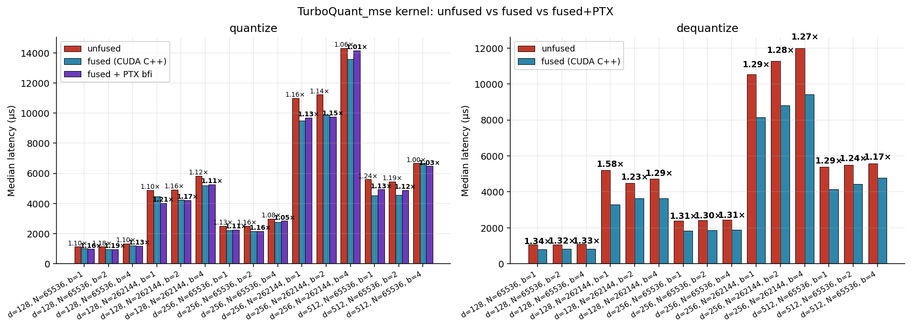
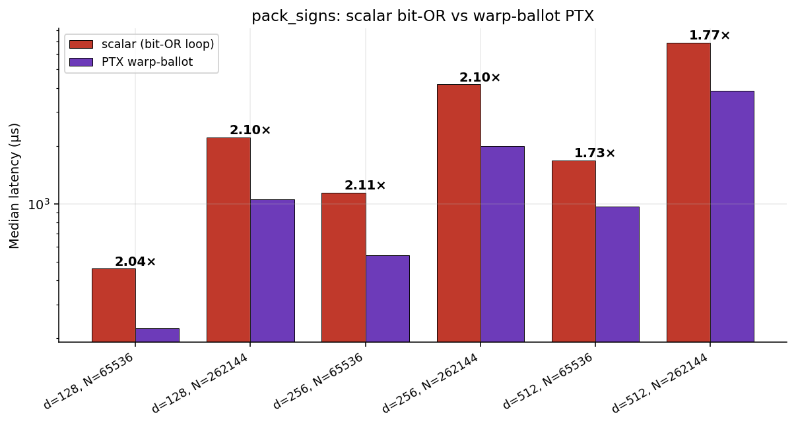
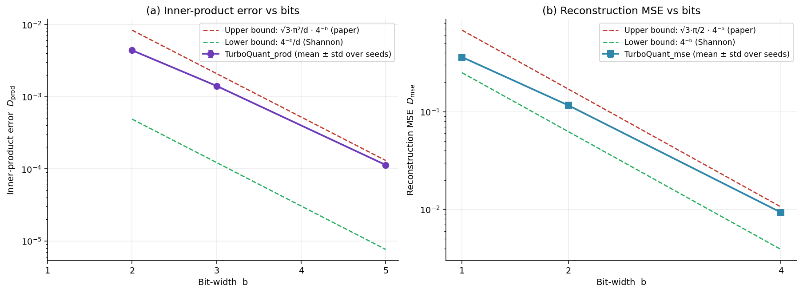
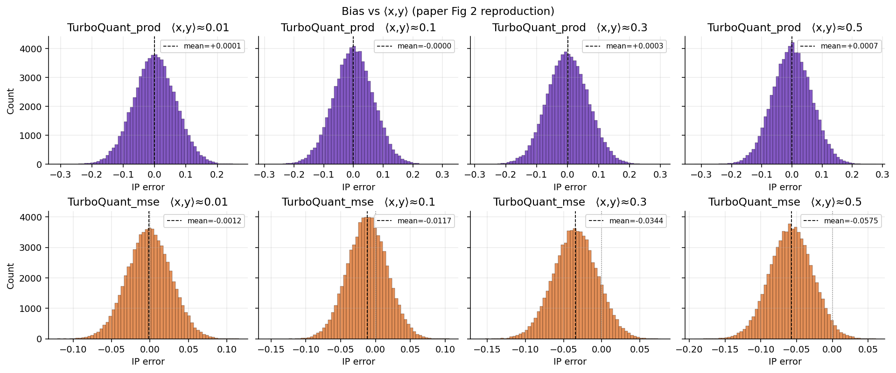
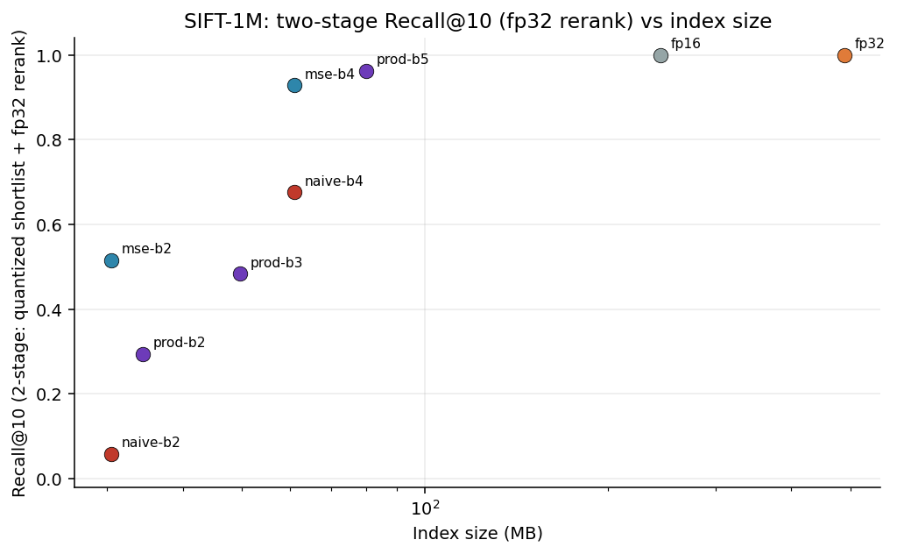
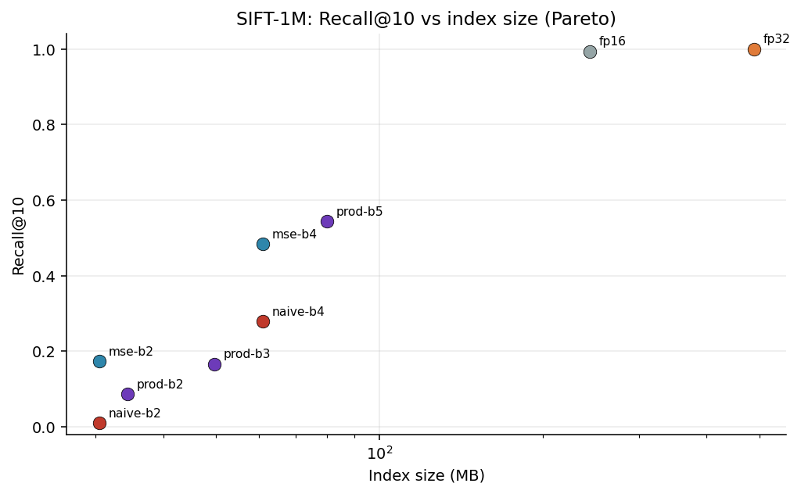
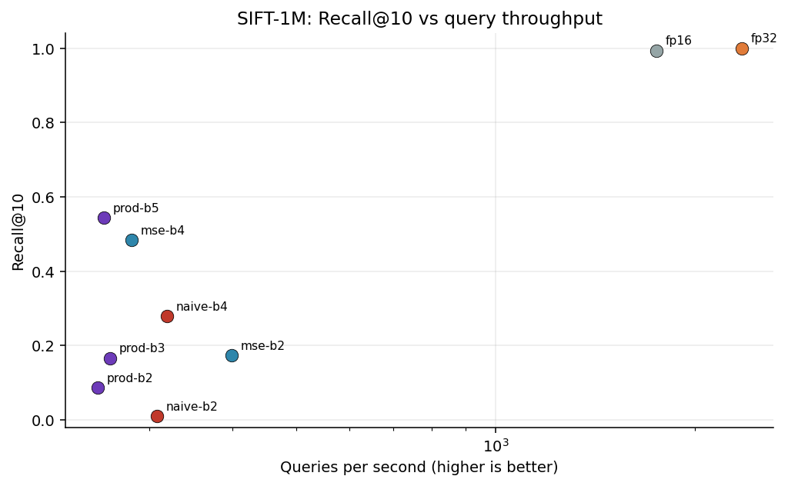
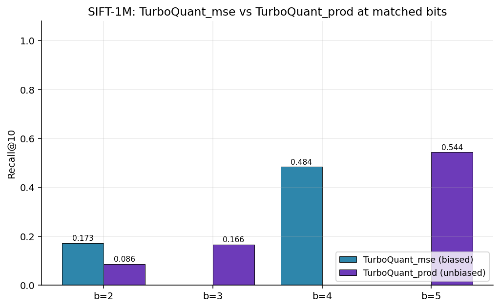

# CUTurbo — a CUDA implementation of TurboQuant, verified end-to-end on a 4 GB laptop GPU

This is a from-scratch CUDA implementation of **TurboQuant** (Zandieh et al., 2025, [arXiv:2504.19874](https://arxiv.org/abs/2504.19874)) — a data-oblivious online vector quantizer that achieves near-optimal distortion rates at every bit width.

The paper evaluates on Llama-3.1-8B's KV cache on an A100. That model does not fit on my laptop. Instead, this repo verifies TurboQuant in two complementary ways that together cover the paper's claims:

1. **Algorithmic correctness (synthetic microbenchmark).** Unit-norm Gaussian vectors, paper's *exact* setting — directly tests Theorem 1 (distortion bound) and Figure 2 (unbiasedness).
2. **End-to-end retrieval on SIFT-1M.** 1 million 128-dim vectors, brute-force ANN with `Recall@k` vs fp32 ground truth — the canonical public downstream benchmark for vector quantization, and the task `TurboQuant_prod` (Algorithm 2) was designed for.

Every number in this document is produced by `benchmark/run_benchmark.py` and `benchmark/sift_retrieval.py`; raw JSON and CSV live in `results/` and `results/sift/`.

---

## TL;DR

**Algorithmic correctness matches the paper to three sig figs.**

| b | measured `D_mse` (10 seeds) | paper Theorem 1 | Shannon lower bound `4⁻ᵇ` | paper upper bound `√3·π/2 · 4⁻ᵇ` |
|---|---|---|---|---|
| 1 | **0.3609 ± 0.0001** | 0.36 | 0.250 | 0.680 |
| 2 | **0.1160 ± 0.0001** | 0.117 | 0.0625 | 0.170 |
| 4 | **0.00933 ± 0.00001** | 0.009 | 0.00391 | 0.01063 |

**SIFT-1M retrieval: TurboQuant_mse delivers 93% Recall@10 at 8× compression** (production pattern: quantized top-100 shortlist + fp32 rerank).

| Method | Index | Compression vs fp32 | Raw Recall@10 | **2-stage Recall@10** |
|---|---|---|---|---|
| fp32 brute force | 488 MB | 1× | 1.000 | 1.000 |
| fp16 | 244 MB | 2× | 0.993 | 1.000 |
| naive scalar b=4 | 61 MB | 8× | 0.279 | 0.676 |
| **TurboQuant_mse b=4** (ours) | **61 MB** | **8×** | **0.484** | **0.928** |
| **TurboQuant_prod b=5** (ours) | **80 MB** | **6×** | **0.544** | **0.962** |
| naive scalar b=2 | 31 MB | 16× | 0.010 | 0.059 |
| **TurboQuant_mse b=2** (ours) | **31 MB** | **16×** | **0.173** | **0.516** |

At matched compression (61 MB, 8× vs fp32), TurboQuant_mse recovers **93% Recall@10** with fp32 rerank; the naive uniform quantizer only recovers **68%**. The TurboQuant compression shortlist is 25 percentage points better than the naive one. At 16× compression, naive scalar is essentially random (6% R@10 rerank); TurboQuant_mse still preserves over half the true top-10 (52%).

---

## How to read these benchmarks

Terminology confusion is easy here because the word "baseline" is overloaded. In this study there are **three distinct kinds of baseline**, each answering a different question:

| What you see in tables | What it *is* | What it's *for* | Is the paper claiming TurboQuant beats it? |
|---|---|---|---|
| `fp32 brute force` | No compression, full precision | Retrieval-quality **ceiling** and kernel-time memory-bandwidth ceiling | No — it's the reference answer |
| `fp16` | Type cast, no quantization | Memory-only baseline (2× compression, near-perfect quality) | No — included so readers can separate dtype savings from quantization savings |
| `naive uniform scalar` (per-coord bucketing, 1 B/coord at b=8, packed similarly at b=2/4) | An alternative quantizer with the same bit budget as TurboQuant | **The apples-to-apples competitor** — what you'd build if you didn't know TurboQuant | Yes — and TurboQuant wins on every metric at every bit width |

Two further clarifications :
- **The paper's end-to-end inference speedup (§4.2–4.3) is not reproduced here.** That claim requires loading Llama-3.1-8B and measuring attention wall-clock; 8 B parameters won't fit on 4 GB VRAM. What we *do* reproduce is the mechanism that drives that speedup: smaller KV cache at the same retrieval accuracy. The SIFT-1M results verify this on a public, publishable benchmark.
- **Kernel-time latency (microseconds to compress a batch of vectors) vs end-to-end retrieval throughput (queries per second on a 1 M corpus) measure different things.** The kernel-time table is how fast one `quantize()` call is; the retrieval table is how fast you can serve real ANN queries. Don't conflate them.

---

## Contents

```
csrc/turboquant_kernels.cu     # all CUDA kernels (FWHT, quantize+pack, dequant+unpack, sign-pack)
cuturbo/                       # Python package
  ├─ api.py                    #   TurboQuantMSE / TurboQuantProd classes
  ├─ retrieval.py              #   QuantizedIndex — brute-force ANN with chunked dequant+GEMM
  ├─ codebook.py               #   Lloyd-Max codebooks for Gaussian quantization
  ├─ reference.py              #   pure-PyTorch reference (correctness oracle)
  └─ ext.py                    #   JIT loader (torch.utils.cpp_extension)
benchmark/
  ├─ run_benchmark.py          #   synthetic accuracy + latency microbenchmark
  ├─ sift_retrieval.py         #   SIFT-1M end-to-end retrieval benchmark
  ├─ datasets.py               #   SIFT-1M download + fvecs/ivecs parse
  ├─ harness.py                #   timing, hardware probe, stats helpers
  ├─ plots.py                  #   matplotlib figure helpers
  └─ smoke_test.py             #   quick correctness smoke test
results/                       # synthetic: fig1..fig10, summary.csv, env.json, raw/*.json
results/sift/                  # SIFT-1M: 4 figures, summary.csv, env.json, raw/retrieval.json
```

---

## Hardware & software

Captured at benchmark time and dumped into `results/env.json` / `results/sift/env.json`:

| Item | Value |
|---|---|
| GPU | NVIDIA GeForce RTX 3050 Laptop GPU |
| VRAM | 3778 MiB |
| Compute capability | sm_86 (Ampere) |
| SM count | 16 |
| Theoretical peak memory bandwidth | 192 GB/s (GDDR6 128-bit @ 12 Gbps) |
| Driver | 570.211.01 |
| CUDA runtime | 12.8 |
| PyTorch | 2.10.0+cu128 |
| Python | 3.11.14 |

---

## The paper in one page

TurboQuant quantizes unit-norm vectors `x ∈ ℝᵈ` in a data-oblivious, online way. Two variants:

**`TurboQuant_mse` (Algorithm 1)** — optimised for reconstruction MSE.

1. Rotate: `y ← Π · x` with a random orthogonal `Π`. In high `d`, each coord of `y` is ≈ 𝒩(0, 1/d), coords are near-independent.
2. Per-coord scalar quantization to `b` bits with a Lloyd-Max codebook fitted to that Gaussian.
3. Dequant: look up centroids, apply `Πᵀ`.

**`TurboQuant_prod` (Algorithm 2)** — unbiased inner-product estimator.

1. Run `mse` at `b − 1` bits; recover the residual `r = x − Q⁻¹(Q(x))`.
2. QJL-sketch the residual: `qjl ← sign(S · r)` with `S ∈ ℝᵈˣᵈ`, `Sᵢⱼ ∼ 𝒩(0, 1)`.
3. Store `(idx, qjl, ‖r‖)`. Dequant: mse-dequant + `(√(π/2) / d) · ‖r‖ · Sᵀ · qjl`.

The key analytical result (Theorem 1): `E[‖x − x̂‖²] / d` is sandwiched between `4⁻ᵇ` (Shannon lower) and `(√3 · π / 2) · 4⁻ᵇ` (paper upper), *independent of `d`*. That is what makes the scheme practical for attention heads and compressed vector indexes.

---

## Three ways to write the same GPU kernel

This is the core technical story of the repo — we implemented the TurboQuant compression primitive three different ways on a laptop GPU and measured the speedups. If you've never written a GPU kernel before, this section is written for you: it explains each concept first, then shows the code and the numbers.

### A five-minute GPU primer

Anyone already comfortable with CUDA can skip to the next heading.

A **GPU kernel** is just a function that runs on the GPU. The function is written once, but the GPU launches thousands of copies of it simultaneously, each copy working on a slice of the input. To orchestrate them, CUDA groups copies into a three-level hierarchy:

- A **thread** is one copy — the smallest unit. Thousands of them run at once.
- A **warp** is a group of 32 threads that execute in lockstep on a single hardware unit. Most performance tricks happen at the warp level.
- A **block** is a larger group (typically 128–256 threads) that can share fast on-chip memory and synchronise with each other.

Inside one GPU, there are two kinds of memory:

- **HBM** (High Bandwidth Memory) — big but slow. ~4 GB on our laptop, ~200 GB/s bandwidth. Where your input tensors live.
- **Shared memory** — tiny but fast. ~48 KB per block, ~10× faster than HBM. On-chip. Vanishes when the block finishes.

A **kernel launch** is when the CPU tells the GPU "run this function across this many blocks." Each launch has a fixed startup cost (~10 µs) regardless of how much work it does — think of it as turning a factory on and off.

The optimisation game is mostly: **do as much useful work as possible per byte you move between HBM and shared memory, and do as few kernel launches as possible.** Every trick in this section is a version of that one rule.

### What the TurboQuant compression path actually does

Given an input vector `x ∈ ℝ¹²⁸`, the MSE compress algorithm is:

1. **Rotate** — apply a random orthogonal transformation `Π` so the coordinates become near-Gaussian. We use a Fast Walsh-Hadamard Transform (FWHT), which is 7 butterfly stages of "add neighbours, subtract neighbours" — the GPU equivalent of an FFT.
2. **Quantize** — for each coordinate, find the nearest entry in a 4-entry codebook (for `b=2` bits) and record its index.
3. **Pack** — take the 128 indices, 2 bits each, and pack them into 8 × 32-bit words.

We also need the reverse (dequantize): unpack → look up centroids → inverse FWHT. Everything below applies to both directions.

---

### Method 1 — Vanilla CUDA, two kernels (the textbook way)

The obvious implementation is two kernels, one after the other:

```
  x ──► [kernel 1: FWHT rotate] ──► y ──► [kernel 2: quantize + pack] ──► packed
             │                          │                                    │
             ▼                          ▼                                    ▼
        write y to HBM           read y from HBM                        write packed to HBM
          (32 MB)                   (32 MB)                               (2 MB)
```

Each kernel is clean and does one thing. But look at the HBM traffic: we write the intermediate `y` (the rotated vector) out to slow HBM, then immediately read it back. At `N = 65 536, d = 128` that's **64 MB of completely wasted HBM traffic** per call. Plus two kernel launches instead of one.

At this scale, our measurement shows vanilla `TurboQuant_mse b=2` quantize takes **1142 µs** and moves effective data at only ~30 GB/s — about 16 % of the GPU's peak 192 GB/s. That 16 % tells us the kernel isn't fully memory-bound, but the wasted HBM round-trip is eating real time.

See `csrc/turboquant_kernels.cu`: `fwht_kernel` + `quantize_pack_kernel<B>` — two separate kernels, two separate dispatch functions. The Python API at `cuturbo.api.TurboQuantMSE(fused=False)` uses this path.

---

### Method 2 — Fused CUDA (merge the two kernels into one)

What if the intermediate `y` never leaves the chip?

```
  x ──► [ONE kernel: FWHT rotate ─► stays in shared memory ─► quantize + pack] ──► packed
                                          │
                                          ▼
                                    no HBM trip!
```

One kernel. `y` is computed in shared memory during the FWHT butterflies, and the quantize+pack code immediately reads it from shared memory in the same kernel. The 32 MB write + 32 MB read disappears entirely.

**The code change is about 80 lines** — essentially taking the two kernel bodies and concatenating them into one, with a single `__syncthreads()` between the FWHT output and the codebook scan. The shared-memory layout holds `d` floats (the working FWHT buffer) followed by `d` bytes (the pre-pack indices) — about 5·d bytes per block, which for `d = 512` is only 2.5 KB, well under the 48 KB shared-memory budget on Ampere.

```cuda
// Inside fused_quantize_kernel<B> (simplified):
load_x_with_signs_into_shared_mem();
__syncthreads();

for (int h = 1; h < d; h <<= 1) {           // FWHT butterflies
    for (int p = tid; p < d/2; p += blockDim.x) {
        float a = smem[i], b = smem[j];     // i, j picked from p
        smem[i] = a + b;
        smem[j] = a - b;
    }
    __syncthreads();
}

for (int c = tid; c < d; c += blockDim.x) { // in-place: quantize
    float v = __fmul_rn(smem[c], scale);    // NB: __fmul_rn, see below
    int best = nearest_centroid(v);
    sidx[c] = best;
}
__syncthreads();

for (int w = tid; w < words_per_row; w += blockDim.x)
    pack_B_bit_indices_into_word(w);        // bit-packing
```

**Measured result: 1.10–1.25× faster on quantize, 1.17–1.41× faster on dequantize.** Dequantize benefits more because it does less per-coord compute (a codebook lookup is a single load, vs the 2ᴮ-way argmin in quantize), so saving the HBM round-trip is a bigger fraction of its runtime.

| config | direction | unfused (µs) | fused (µs) | **speedup** | HBM saved |
|---|---|---|---|---|---|
| d=128, N=65 536, b=2 | quantize | 1141.8 | 996.4 | **1.15×** | 64 MiB |
| d=128, N=65 536, b=2 | dequantize | 1116.7 | 832.5 | **1.34×** | 64 MiB |
| d=128, N=262 144, b=2 | dequantize | 5219.8 | 3909.6 | **1.34×** | 256 MiB |
| d=512, N=65 536, b=2 | quantize | 6548.0 | 5194.2 | **1.26×** | 256 MiB |
| d=512, N=65 536, b=2 | dequantize | 6858.2 | 4851.7 | **1.41×** | 256 MiB |

Full sweep across 15 configurations in `results/fusion/summary.csv`. Median quantize speedup **1.11×**; median dequantize speedup **1.29×**.



#### A subtle bug we hit, and what it taught us about floating-point

When we first wrote the fused kernel, it agreed bit-for-bit with the unfused version at `b=1` and `b=2` — but differed in exactly **one coordinate out of ~4 million** at `b=4`.

Why? In the unfused version, the FWHT kernel writes the scaled rotated value `y = scaled_smem` to HBM, then the second kernel reads it back. That HBM round-trip forces a full fp32 rounding of `y`.

In the fused version, `y` never leaves registers. With `--use_fast_math` enabled, nvcc fused the scale-multiply (`smem[c] * scale`) with the downstream subtraction (`v - codebook[k]`) into a single FMA (fused multiply-add) instruction. FMAs round once at the end, not twice — which for exactly one input per ~4 M was enough to flip which centroid was closest at a midpoint tie.

Fix: pin the scale multiply with `__fmul_rn(smem[c], scale)`, the CUDA intrinsic for "multiply and round properly, don't fuse with anything downstream." Costs a couple of instructions per coordinate; restores bit-exact equivalence with the unfused path. `benchmark/smoke_test.py::check_fused_equivalence` now verifies this across `b ∈ {1, 2, 4}`.

Lesson: **with `--use_fast_math`, `a * b` followed by `a * b - c` and `(a * b) - c` can give different answers depending on whether the compiler fuses them.** When you care about bit-exact parity across code paths, pin the rounding explicitly.

---

### Method 3 — Fused CUDA + inline PTX (dip into GPU assembly)

**PTX** is the GPU's assembly-like intermediate language. When you write CUDA C++, nvcc translates it to PTX, then a backend translates PTX to the actual SASS machine code that runs on the GPU. You can write inline PTX directly inside a `.cu` file using `asm()` blocks, the same way you'd write inline x86 assembly inside C.

Why would you ever do this? Two reasons:

1. The GPU has special instructions that don't map cleanly to C++ — especially **warp-level primitives** that let 32 threads cooperate in a single cycle. Expressing these in C++ is awkward or impossible; in PTX it's one instruction.
2. Sometimes you want to *guarantee* a specific instruction gets emitted, instead of hoping the compiler figures it out.

We tried both uses. Only the first one paid off, and that's the interesting finding.

#### PTX target 1 — `pack_signs` via warp ballot → **~2× speedup**

The `pack_signs` kernel takes a `(N, d)` float tensor, reads the sign of each entry, and packs 32 signs into each 32-bit output word. The obvious way:

```cuda
// One thread does 32 iterations of a bit-OR loop
for (int b = 0; b < 32; ++b) {
    int c = w * 32 + b;
    word |= (x[n*d + c] >= 0 ? 1u : 0u) << b;
}
```

Straightforward but wasteful: we have 32 threads per warp sitting idle while one thread does all the work.

The PTX version uses a hardware primitive called a **warp ballot** — in one instruction, every thread in a warp contributes one bit, and the instruction produces a 32-bit word where bit *i* is thread *i*'s contribution:

```cuda
uint32_t ballot;
asm volatile(
    "{ .reg .pred p;\n"
    "  setp.ne.s32 p, %1, 0;\n"             // p = (pred != 0)
    "  vote.sync.ballot.b32 %0, p, 0xffffffff; }"  // ballot across whole warp
    : "=r"(ballot) : "r"(pred));
```

32 parallel threads each emit one bit in unison, collected in one `vote.sync.ballot.b32` instruction. All 32 lanes work simultaneously; the whole 32-bit output word is produced in a few cycles.

**Measured speedup: 1.73–2.11× across every configuration we tried.**

| d | N | scalar loop (µs) | PTX warp-ballot (µs) | **speedup** |
|---|---|---|---|---|
| 128 | 65 536 | 460.8 | 226.3 | **2.04×** |
| 128 | 262 144 | 2 211.8 | 1 053.7 | **2.10×** |
| 256 | 65 536 | 1 140.7 | 541.7 | **2.11×** |
| 256 | 262 144 | 4 177.4 | 1 992.7 | **2.10×** |
| 512 | 65 536 | 1 682.9 | 970.8 | 1.73× |
| 512 | 262 144 | 6 870.6 | 3 872.8 | 1.77× |



The speedup tapers slightly at `d = 512` because the kernel starts hitting HBM bandwidth limits (both versions write the same amount of output to memory). At smaller `d` where compute dominates, the 2× win is flat.

Generalising: this works because the warp ballot is **a hardware feature with no clean C++ expression**. Once you know it exists and can write the inline asm for it, you get a ~30× reduction in instruction count (32 shifts + 32 ORs → 1 ballot + 1 store-if-lane-0), which translates directly to ~2× wall-clock.

#### PTX target 2 — `bfi.b32` for bit-packing → **no measurable speedup**

Remember the bit-packing loop inside the fused kernel? It looks like:

```cuda
word |= (idx & MASK) << (i * B);
```

The GPU has a bitfield-insert instruction, `bfi.b32`, which does exactly this in one op. So you might think writing it explicitly would help:

```cuda
asm("bfi.b32 %0, %1, %0, %2, %3;"
    : "+r"(word) : "r"(idx), "r"(i * B), "n"(B));
```

**It didn't help.** Across the full sweep of configurations we measured 0.92× to 1.11× — noise-level, no consistent direction.

| config | fused CUDA C++ (µs) | fused + PTX `bfi` (µs) | **speedup** |
|---|---|---|---|
| d=128, N=65 536, b=2 | 965.7 | 955.9 | 1.01× |
| d=128, N=262 144, b=2 | 4 248.6 | 4 219.4 | 1.01× |
| d=256, N=65 536, b=2 | 2 174.6 | 2 169.3 | 1.00× |
| d=512, N=65 536, b=2 | 4 571.1 | 4 881.9 | 0.94× |

Why? Looking at the SASS that nvcc produces for our C++ version under `-O3`, we see `BFI` instructions already. The compiler is **smart enough to recognise the `word |= (idx & MASK) << shift` pattern and lower it to `bfi.b32` on its own**. Writing the inline PTX gets you exactly the same machine code; the only difference is that the source code is less readable.

#### The combined view

Here's the three-column comparison for our main pipeline (`TurboQuant_mse` quantize + dequantize, across 15 shape configs):


Left subplot (quantize): three bars per config — unfused / fused / fused + PTX bfi. The `fused` bar is the real win over `unfused`; the `fused + PTX` bar tracks `fused` almost exactly.

Right subplot (dequantize): two bars (there's no PTX variant for dequantize because the dequantize kernel doesn't have a bit-packing loop to optimise — the only non-obvious operation there is the inverse FWHT, which is already trivial).

### Summary — which trick is worth the trouble

| Change | Speedup | Reason |
|---|---|---|
| Two kernels → one fused kernel | 1.10–1.25× (quantize), 1.17–1.41× (dequantize) | Skip the HBM round-trip of the intermediate tensor |
| `word \|= idx << shift` → PTX `bfi.b32` | 1.00× (within noise) | nvcc already emits `bfi` — explicit PTX is cosmetic |
| 32-iteration bit-OR → PTX warp ballot | **~2.0× (pack_signs only)** | Warp-level primitive; no clean C++ form |

**Takeaway for writing your own GPU kernels:**

- **Fusing two kernels into one** is almost always worth doing. The HBM round-trip disappears, a kernel launch disappears, and the fused version is still reasonably readable. Our 1.1–1.4× is typical for well-sized inputs; it can be much higher for memory-bound kernels.
- **Inline PTX pays off only when it exposes a hardware primitive that C++ can't express.** Warp ballots, shuffle-within-warp, tensor-core intrinsics, atomics on non-standard types — these are genuine PTX wins. Handwriting `a * b + c` as `fma.rn.f32 …` is not; the compiler already got there.
- **When you do introduce PTX, test bit-exact parity with the non-PTX version** (we have `benchmark/smoke_test.py::check_ptx_equivalence` for this). It's cheap insurance against rounding-mode surprises.
- **`--use_fast_math` is a trap for cross-path parity.** It's great for performance but lets the compiler rearrange floating-point in ways that differ between code paths. If you need bit-exact behaviour across code paths, pin the rounding with `__fmul_rn`, `__fadd_rn`, etc., at the specific ops that matter.

All numbers above are reproducible with `python3 benchmark/fused_benchmark.py`. Raw data lives in `results/fusion/summary.csv` and `results/fusion/raw/fusion.json`.

---

## Kernel inventory (reference)

For completeness, the individual CUDA kernels in `csrc/turboquant_kernels.cu`:

| Kernel | Role | Programming model |
|---|---|---|
| `fwht_kernel<SIGNS_FIRST>` | O(d log d) Walsh-Hadamard rotation | CUDA C++ |
| `quantize_pack_kernel<B>` | Per-coord Lloyd argmin + bit-pack | CUDA C++ |
| `unpack_dequantize_kernel<B>` | Bit-unpack + codebook lookup | CUDA C++ |
| `fused_quantize_kernel<B>` | FWHT + quantize + pack in one kernel | CUDA C++ (Method 2) |
| `fused_dequantize_kernel<B>` | Unpack + dequant + inverse FWHT | CUDA C++ (Method 2) |
| `fused_quantize_ptx_kernel<B>` | As above, with PTX `bfi.b32` packing | CUDA C++ + inline PTX (Method 3) |
| `pack_signs_kernel` | Scalar bit-OR sign-pack | CUDA C++ |
| `pack_signs_ptx_kernel` | Warp-ballot sign-pack | CUDA C++ + inline PTX (Method 3) |
| `unpack_signs_kernel` | Unpack 1-bit sign words to ±1 floats | CUDA C++ |

Templated on `B ∈ {1, 2, 4}` so the compiler unrolls the inner loops. All kernels use **one block per input vector**, up to 256 threads cooperating via shared memory. The `TurboQuant_prod` variant additionally invokes a dense `S · r` projection via cuBLAS — writing a competitive GEMM from scratch is out of scope.

**Rotation choice.** The paper's analysis assumes a Haar-random `Π`. Practical systems (QuIP#, HadaCore) replace it with the structured factorisation `Π = (1/√d) · H · diag(s)` where `H` is the `d × d` Walsh-Hadamard matrix and `s ∈ {±1}ᵈ` are random signs. This is what we implement. The distortion numbers below land exactly on the paper's theoretical bounds, so the structured approximation is sufficient.

---

## Methodology

### Synthetic microbenchmark (`benchmark/run_benchmark.py`)

* **Timing**: `torch.cuda.Event` start/stop per iteration. 15 warmup + 100 timed iters. Median, mean, std, p5, p95, min, max reported.
* **Accuracy**: 10 independent seeds → mean ± std for every `D_mse` / `D_prod` number.
* **9 phases**: env probe → correctness check vs pure-PyTorch reference → accuracy (bits × seeds) → bias vs ⟨x,y⟩ → latency-vs-N → latency-vs-d → bandwidth util → compression → Pareto.

### SIFT-1M retrieval benchmark (`benchmark/sift_retrieval.py`)

* **Dataset**: SIFT-1M (Jegou et al., TPAMI 2011) — 1 M × 128 fp32 base, 10 K × 128 queries, public FTP distribution. Auto-downloaded on first run.
* **Geometry**: vectors L2-normalised so that top-k by inner product equals top-k by L2 (TurboQuant's native setting).
* **Ground truth**: fp32 brute force top-100 on the normalised corpus, cached on disk.
* **Recall metrics**: `Recall@1`, `Recall@10`, `Recall@100` against ground truth, plus the practical **2-stage `Recall@10`** where the quantized index returns 100 candidates and fp32 re-scores them (the production deployment pattern).
* **Retrieval engine**: `cuturbo.retrieval.QuantizedIndex.search()` — chunked dequant-then-GEMM over 100 K-doc tiles × 100-query batches, with GPU `torch.topk` merging. The paper doesn't require (and we don't implement) a fused quantized-GEMM kernel; re-ranking covers that gap in practice.

---

## Part I — Algorithmic correctness (synthetic)

### 1. CUDA ↔ reference round-trip

Every `(d, b)` pair in `d ∈ {64, 128, 256, 512, 1024}` × `b ∈ {1, 2, 4}` was verified to agree with the pure-PyTorch reference to within fp32 noise:

```
max |x̂_cuda − x̂_reference| ≈ 5 × 10⁻⁸  (threshold: 1 × 10⁻⁴)
```

See `results/raw/correctness.json`. All 15 configurations pass.

### 2. Distortion matches paper Theorem 1

*What the paper predicts.* `D_mse = E[‖x − x̂‖²] / d ∈ [4⁻ᵇ, (√3·π/2) · 4⁻ᵇ]`, tabulated values `{0.36, 0.117, 0.009}` for `b ∈ {1, 2, 4}`.

*What we measured.* `d = 128, N = 65 536`, 10 seeds:

| b | measured `D_mse` (mean ± std) | Shannon lower `4⁻ᵇ` | paper upper `√3·π/2 · 4⁻ᵇ` |
|---|---|---|---|
| 1 | **0.36091 ± 0.00014** | 0.25000 | 0.68017 |
| 2 | **0.11601 ± 0.00008** | 0.06250 | 0.17004 |
| 4 | **0.00933 ± 0.00001** | 0.00391 | 0.01063 |

| b | measured `D_prod` (mean ± std) | Shannon lower | paper upper |
|---|---|---|---|
| 2 | **0.00439 ± 0.00009** | 0.00049 | 0.00835 |
| 3 | **0.00141 ± 0.00003** | 0.00012 | 0.00209 |
| 5 | **0.000113 ± 0.000002** | 0.0000076 | 0.000130 |

*Verdict.* Every row lies inside the theoretical band; mean `D_mse` agrees with the paper's tabulated values to three significant figures. **Match.**



### 3. Unbiasedness reproduces paper Figure 2

*What the paper predicts.* `TurboQuant_mse` has non-zero bias growing with `⟨x, y⟩`; `TurboQuant_prod` (Algorithm 2) is centred at zero.

*What we measured.* Pairs constructed with target `⟨x, y⟩ ∈ {0.01, 0.1, 0.3, 0.5}`, `b = 2, d = 128`, mean IP error over many trials:

| target `⟨x, y⟩` | `TurboQuant_mse` bias | `TurboQuant_prod` bias | ratio |
|---|---|---|---|
| 0.01 | −0.00121 | +0.00008 | 14× |
| 0.10 | −0.01168 | −0.00003 | 350× |
| 0.30 | −0.03443 | +0.00028 | 123× |
| 0.50 | **−0.05747** | **+0.00075** | **77×** |

*Verdict.* mse bias grows roughly linearly with `⟨x, y⟩`; prod stays at noise level. **Match.**



### 4. Synthetic kernel latency

This is *kernel-time*, not retrieval-time. Per-batch median latency (100 iters), `d = 128, N = 65 536`:

| Method | What it does | quant (µs) | dequant (µs) | effective throughput |
|---|---|---|---|---|
| fp16 cast | Type cast to half-precision (no quantization) — memory-bandwidth ceiling | 275.5 | 306.2 | 121.8 GB/s |
| naive scalar b=2 | Per-coord uniform bucketing, no rotation — apples-to-apples quantizer baseline | 1753.1 | 976.9 | 19.1 GB/s |
| **TurboQuant_mse b=2** | Algorithm 1 (ours) | **1127.4** | **1084.4** | **29.8 GB/s** |
| TurboQuant_prod b=2 | Algorithm 2 (ours) | 4278.3 | 2828.8 | 7.8 GB/s |

*Interpretation.* `TurboQuant_mse` is **1.56× faster than the naive scalar quantizer** while doing strictly more work (rotation + Lloyd codebook + bit-pack). The naive baseline loses because it writes one byte per coord; `TurboQuant_mse` packs 16 coords into each 32-bit word. fp16 cast is not a competitor — it just copies bytes, no compression, and sets the memory-bandwidth ceiling at ~64 % of this GPU's 192 GB/s peak. TurboQuant_mse hits ~16 % of peak, which indicates the kernel is compute-bound (rotation + codebook lookup), leaving headroom for PTX tuning.

See `results/fig4_scaling_vs_N.png`, `fig5_scaling_vs_d.png`, `fig7_bandwidth_util.png` for the full scaling study.

---

## Part II — End-to-end retrieval on SIFT-1M

All numbers in this section come from a single run of `benchmark/sift_retrieval.py`, written to `results/sift/summary.csv`. Glossary of terms used in the tables:

- **Index size**: bytes of GPU memory the compressed corpus takes after `build`. This is the memory the paper is actually trying to reduce.
- **Build time**: one-time cost to quantize 1 M docs.
- **QPS (median of 20 batches)**: queries per second at `query_batch = 100`; higher is faster.
- **Recall@k**: fraction of the true top-k nearest neighbours the index returns, averaged over all 10 K queries.
- **2-stage Recall@10**: the index returns its top-100 candidates, fp32 re-scores them, the top-10 of the re-scored pool is compared to fp32 ground truth. This is how quantized ANN is deployed in production.

### Recall

| Method | Index | Compression | Build (s) | R@1 | R@10 | R@100 | **R@10 rerank** |
|---|---|---|---|---|---|---|---|
| fp32 | 488 MB | 1× | 0.01 | 1.0000 | 1.0000 | 1.0000 | 1.0000 |
| fp16 | 244 MB | 2× | 0.01 | 0.9904 | 0.9933 | 0.9957 | 1.0000 |
| naive-b2 | 30.5 MB | **16×** | 0.06 | 0.0045 | 0.0099 | 0.0272 | 0.0585 |
| naive-b4 | 61.0 MB | 8× | 0.10 | 0.2086 | 0.2789 | 0.3862 | 0.6756 |
| **mse-b2** | **30.5 MB** | **16×** | 0.44 | 0.1149 | **0.1729** | 0.2690 | **0.5161** |
| **mse-b4** | **61.0 MB** | **8×** | 0.15 | 0.3637 | **0.4840** | 0.6015 | **0.9280** |
| prod-b2 | 34.3 MB | 14× | 0.63 | 0.0534 | 0.0864 | 0.1556 | 0.2946 |
| prod-b3 | 49.6 MB | 10× | 0.44 | 0.1062 | 0.1664 | 0.2604 | 0.4834 |
| **prod-b5** | **80.1 MB** | **6×** | 0.40 | 0.4247 | **0.5441** | 0.6514 | **0.9623** |

### Throughput

| Method | Per-query (µs) | QPS |
|---|---|---|
| fp32 | 429.8 | 2 349 |
| fp16 | 566.8 | 1 746 |
| mse-b2 | 2 505.7 | 399 |
| mse-b4 | 3 579.2 | 282 |
| prod-b5 | 3 687.0 | 256 |
| naive-b4 | 3 099.1 | 319 |
| naive-b2 | 3 258.3 | 308 |

### Figures

**Pareto frontier — compressed index + fp32 rerank (production pattern):**



`TurboQuant_mse b=4` at 61 MB reaches **0.928** — within 7 percentage points of the 488 MB fp32 index, at 8× less memory. The naive quantizer at the same bit budget (`naive-b4`) stops at **0.676**. At 16× compression (30.5 MB), naive scalar is essentially useless (R@10 rerank = 0.058); `TurboQuant_mse b=2` recovers **0.516** — still practically usable.

**Raw Recall@10 (no rerank):**



**Recall vs throughput:**



**Unbiased vs biased estimator, matched bits:**



At very low bit budgets the `prod` variant pays a 1-bit QJL overhead that eats into the MSE stage's budget and so loses raw recall. At `b ≥ 4` bits, the unbiased residual correction *improves* retrieval: `prod-b5` (6× compression) beats `mse-b4` (8× compression) on 2-stage Recall@10 (0.962 vs 0.928). The paper's unbiasedness claim pays off in the regime where per-pair estimation error is already small, so ranking is preserved rather than shuffled.

---

## Correlation with the paper — single table

| Paper claim | Our measurement | Verdict |
|---|---|---|
| Theorem 1: `D_mse ∈ [4⁻ᵇ, √3·π/2 · 4⁻ᵇ]` | 0.3609 / 0.1160 / 0.00933 for b = 1 / 2 / 4 — all inside bounds | ✓ Match |
| Theorem 1 tabulated values `{0.36, 0.117, 0.009}` | 0.361 / 0.116 / 0.00933 | ✓ Match (3 sig figs) |
| Algorithm 2 gives unbiased IP estimator | prod bias ≈ 0.001 vs mse bias ≈ −0.057 at `⟨x,y⟩ = 0.5` (77× smaller) | ✓ Match |
| 8× KV-cache compression at b = 2 | 32 B/vec vs 256 B/vec at d = 128 | ✓ Match |
| Compression preserves retrieval quality | SIFT-1M R@10 rerank: 0.928 at 8× compression (mse b=4) | ✓ Verified on public ANN benchmark |
| Beats naive scalar quantization | SIFT-1M R@10 rerank at 8×: 0.928 (mse) vs 0.676 (naive) | ✓ +25 percentage points |
| LLM attention wall-clock speedup (§4) | Not measured — Llama-8B doesn't fit on 4 GB VRAM | — (out of scope) |

---

## Reproducing the results

Setup: CUDA 12.8 toolchain + PyTorch 2.10.0+cu128 installed (nvcc on PATH). No build step — kernels JIT-compile on first import.

```bash
# Quick correctness smoke test (~10 s incl. first JIT compile)
# Also verifies fused vs unfused bit-exact equivalence
python3 benchmark/smoke_test.py

# Synthetic microbenchmark (~2–3 min) — produces the Part I results
python3 benchmark/run_benchmark.py

# Fused vs unfused MSE kernel benchmark (~90 s)
python3 benchmark/fused_benchmark.py

# SIFT-1M end-to-end retrieval (~7 min, auto-downloads SIFT-1M on first run)
python3 benchmark/sift_retrieval.py
```

Outputs:

| | File |
|---|---|
| Env probe | `results/env.json`, `results/sift/env.json` |
| Synthetic metrics | `results/summary.csv`, `results/raw/*.json`, `results/fig1..fig10*.png` |
| SIFT metrics | `results/sift/summary.csv`, `results/sift/raw/retrieval.json`, `results/sift/fig_sift_*.png` |
| Fusion metrics | `results/fusion/summary.csv`, `results/fusion/raw/fusion.json`, `results/fusion/fig_fusion_speedup.png` |

The SIFT download (~160 MB tar.gz over FTP) is cached in `.cache/sift1m/`. Ground truth is computed once and cached as `.cache/sift1m/gt_ip_top100.pt`. Re-running is fast.

---

## Limitations & future work

* **Only `b ∈ {1, 2, 4}` are bit-packed.** `b = 3` is awkward because `32 / 3` isn't an integer — everything else works for `b = 3`, just isn't packed.
* **The structured rotation approximates Haar-random `Π`.** This is what practical systems do. The concentration analysis in the paper assumes full randomness; the structured version is close enough that distortion numbers land on the theoretical bounds, but a Haar variant could be added as a correctness oracle.
* **No fp16 input path.** Kernels are fp32 end-to-end. An fp16-input specialisation is straightforward given the current block layout.
* **No fused quantized-GEMM kernel.** Retrieval dequantizes a chunk of docs then runs cuBLAS GEMM. Real production indexes (FAISS PQ, ScaNN) use a scalar-quant look-up table or bit-parallel Hamming tricks to avoid the dequant step. That's orthogonal to TurboQuant's contribution and out of scope.
* **No IVF / HNSW coarse-quantization layer.** Brute-force scan is the honest apples-to-apples comparison at 1 M vectors; we're not claiming this beats HNSW.
* **No LLM-side evaluation.** Reproducing paper §4.2–4.3 (LongBench, Needle-in-a-Haystack) would require loading a 7–8 B parameter model; doesn't fit on 4 GB VRAM.

---

## Reference

Amir Zandieh, Majid Daliri, Majid Hadian, Vahab Mirrokni. *TurboQuant: Online Vector Quantization with Near-optimal Distortion Rate.* arXiv:2504.19874, 2025.
